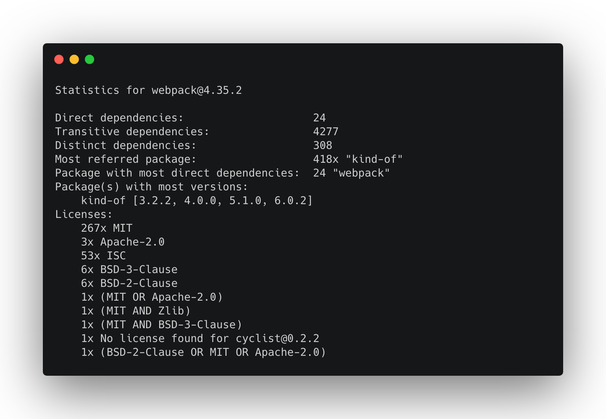

# Node.js Package Analyzer (pkga)
[](https://dev.azure.com/tmkndev/packageanalyzer/_build/latest?definitionId=1&branchName=master)
[](https://codecov.io/gh/tmkn/packageanalyzer)
[](https://sonarcloud.io/dashboard?id=tmkn_packageanalyzer)
[](https://sonarcloud.io/dashboard?id=tmkn_packageanalyzer)


> A sample output of the `analyze` command


A framework to introspect Node.js projects.

Stats are fun!

Please see the [Documentation](http://packageanalyzer-docs.vercel.app/) for a more in depth introduction.

## Prints various statistics:
* Number of transitive dependencies
* Number of distinct dependencies
* Most referred package
* Package with most direct dependencies
* Package with most versions
* Licenses

## Install
```
yarn add @tmkn/packageanalyzer
```

## Usage
The package analyzer is both a CLI and a framework.

As such it provides the following CLI options (non exhaustive!):
### Analyze latest version of a package
`pkga analyze --package typescript`
### Analyze specific version of a package
`pkga analyze --package typescript@3.5.1`
### Analyze local folder
`pkga analyze --folder path/to/folder/with/package.json`
### Print dependency tree
`pkga tree --package typescript`
### Print licenses
`pkga license --package typescript`
### Run custom report
`pkga report --config path/to/custom/report.js`

Please see [Using custom reports](https://packageanalyzer-docs.vercel.app/docs/guides/custom_reports) on how to use the package analyzer programatically.

## Setting up the dev environment
```
git clone https://github.com/tmkn/packageanalyzer.git
yarn install
yarn build
```
See [ARCHITECTURE.md](ARCHITECTURE.md) for a quick tour around the code

### Watch mode
`yarn dev`
### Build
`yarn build`
## Tests
### Run tests
`yarn test`
### Code Coverage
`yarn test:coverage`
### Watch tests
`yarn test:watch`

## Roadmap
* Stabilize API
* Better ux for missing cli/reports parameters
* Finding a better shorthand name
* Release v1 :)

## License
MIT
